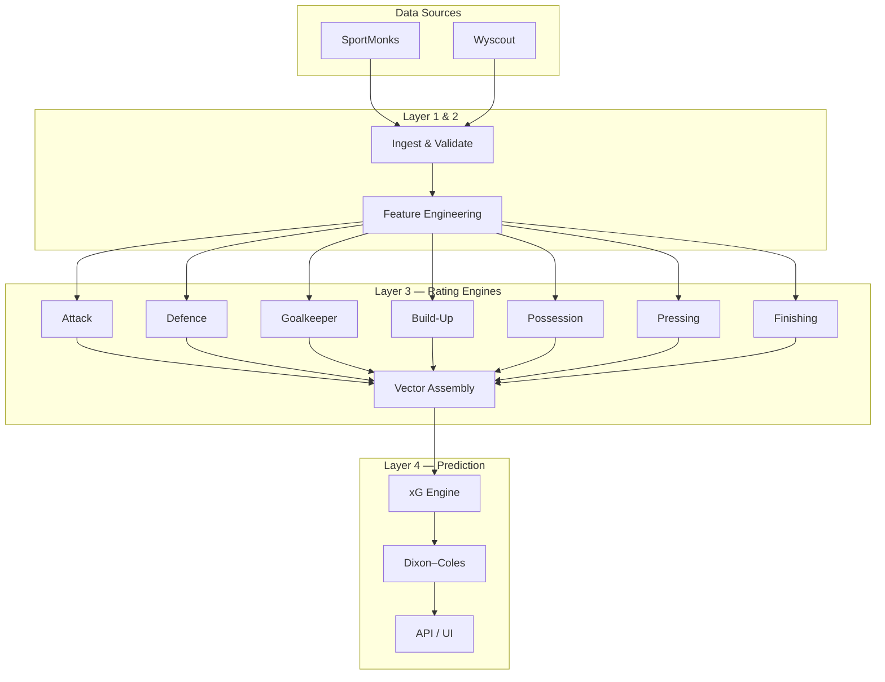

# Graham League Prediction Model (GLPM)

**Co-founder guide — what we built, how it works, and how to run it**

*Last updated: July 2026*

---

## Table of contents

1. [Executive summary](#1-executive-summary)
2. [What we implemented](#2-what-we-implemented)
3. [What changed from the old model](#3-what-changed-from-the-old-model)
4. [How predictions work moving forward](#4-how-predictions-work-moving-forward)
5. [System architecture](#5-system-architecture)
6. [Data: what we need and why](#6-data-what-we-need-and-why)
7. [Why this is machine learning](#7-why-this-is-machine-learning)
8. [Training the model](#8-training-the-model)
9. [The seven rating engines](#9-the-seven-rating-engines)
10. [Rating vectors and Bayesian updates](#10-rating-vectors-and-bayesian-updates)
11. [Expected goals engine](#11-expected-goals-engine)
12. [Match prediction markets](#12-match-prediction-markets)
13. [Operational runbook](#13-operational-runbook)
14. [Glossary](#14-glossary)

---

## 1. Executive summary

The **Graham League Prediction Model (GLPM)** is our new probabilistic framework for **club football** (domestic leagues). It replaces a single “team strength” number with a **seven-dimensional rating system** that estimates how many quality chances each team will create against a specific opponent — then derives every betting market from those expected goals.

**Core idea:** Goals are noisy. Expected goals (xG) are not. GLPM predicts xG first, then converts xG into scorelines, 1X2, BTTS, and Over/Under probabilities using the same underlying math every time.

**What makes it different:**

| Old approach | GLPM |
|---|---|
| One composite strength index | Seven specialist ratings (attack, defence, GK, build-up, possession, pressing, finishing) |
| Rank teams | Estimate chance creation vs a specific opponent |
| Markets may use different logic | All markets from one xG pair via Dixon–Coles |
| Mixed data sources for clubs | Dedicated `glpm_*` schema; SportMonks primary, Wyscout enrichment |

The World Cup / national-team predictor is **unchanged**. GLPM applies to **club** mode only.

---

## 2. What we implemented

### 2.1 End-to-end pipeline

We built a full production stack from raw match data to UI:

```
Football data (SportMonks primary + optional Wyscout enrich)
        ↓
Layer 1 — Match ingest & storage
        ↓
Layer 2 — Feature engineering
        ↓
7 rating engines (ML training)
        ↓
Rating Vector assembly  R = [A, D, GK, BU, PO, PR, FR]
        ↓
Optional Bayesian temporal smoothing
        ↓
Expected Goals Engine  →  xG_home, xG_away
        ↓
Dixon–Coles score matrix  →  1X2, BTTS, O/U, correct scores
        ↓
API + League Hub UI
```

### 2.2 Software components

| Layer | What it does | Key location |
|---|---|---|
| **Data ingest** | Pull fixtures, team stats, xG Basic, lineup GK stats from SportMonks; optional Wyscout PPDA/shot enrich | `src/lib/glpm/ingestMatch.ts`, `scripts/glpm-sportmonks-*.ts` |
| **Feature engineering** | Turn raw stats into model-ready per-match features | `features/*.py`, `src/lib/glpm/layer2/` |
| **Rating engines (×7)** | Train hierarchical ML models per football domain | `models/ratings/{attack,defence,...}/` |
| **Vector assembly** | Combine seven primary ratings into one vector per team | `core/vector_assembly.py` |
| **Bayesian updater** | Smooth ratings over time with uncertainty | `core/bayesian.py` |
| **xG engine** | Map rating vectors + context → expected goals | `engine/xg_engine.py` |
| **Prediction engine** | Map xG → probability distributions | `engine/predictions.py` |
| **TypeScript mirror** | Same math in the Next.js app for live API predictions | `src/lib/glpm/engine/` |
| **Database** | Dedicated Supabase schema (`glpm_*` tables) | `supabase/migrations/030–039` |
| **UI** | Club predictor + league hub | `/predict` (club mode), `/league` |

### 2.3 User-facing surfaces

- **`/predict` (Club mode)** — Pick season, home team, away team → GLPM returns xG, 1X2, BTTS, O/U, and interaction breakdown.
- **`/league` (League Hub)** — Season picker, rating leaderboards, recent results with underlying stats, upcoming fixtures with model lines.
- **API routes** — `/api/glpm/predict`, `/api/glpm/hub`, `/api/glpm/seasons`, `/api/glpm/teams`.

### 2.4 Specification documentation

The full statistical methodology lives in the **GOD_FILE** chapters (`docs/GOD_FILE_CHAPTER_*.md`). This guide focuses on what was built, how to operate it, and the equations that matter day-to-day.

---

## 3. What changed from the old model

### 3.1 Philosophy shift

The World Cup model asks: *“How strong is this team overall?”* — combining Elo, FIFA rank, momentum, form, and talent into one index.

GLPM asks: *“How many quality chances will Team A create against Team B’s specific defence, goalkeeper, and pressing style?”*

That decomposition is the biggest conceptual change. A team can be elite in attack and average in defence — a single number hides that.

### 3.2 Technical changes

| Area | Before (club) | Now (GLPM) |
|---|---|---|
| Team representation | Composite / Elo-style strength | 7 primary ratings → Rating Vector |
| Prediction input | General match form + mixed sources | Latest `glpm_team_rating_vectors` per team |
| xG calculation | Ad hoc or WC-derived | Interaction matrix + `μ · exp(c · ΔS)` |
| Markets | Could vary by mode | Unified Dixon–Coles from same xG pair |
| Data schema | FBref / general tables | Dedicated `glpm_*` tables |
| Primary data provider | Mixed | **SportMonks** (primary), **Wyscout** (enrichment) |
| Explainability | Strength breakdown | Per-matchup deltas: Attack–Defence, Finishing–GK, Build-Up–Pressing, Possession–Pressing |

### 3.3 What stayed the same

- **National / World Cup mode** on `/predict` still uses the existing World Cup strength-index flow, fixture picker, and squad XI editor.
- The **Graham xG formula** (`μ · exp(c · ΔS)`) is reused from the validated World Cup engine — GLPM replaces the *strength front-end* (single ΔS from Elo) with the *multi-dimensional interaction matrix*.
- **Context adjustments** (home advantage, rest, travel, altitude) mirror proven constants from the club stadium-impact and WC rest-delta helpers.

---

## 4. How predictions work moving forward

Every club prediction follows the same sequence:

1. **Load the latest Rating Vector** for home and away teams (as of a given date in the season).
2. **Compute tactical matchups** — four interaction pairs per attacking side.
3. **Combine into a strength index** ΔS (weighted, capped).
4. **Apply the Graham baseline** — `xG_base = μ · exp(c · ΔS)`.
5. **Apply context multipliers** — home advantage, rest days, travel, altitude.
6. **Build a Dixon–Coles score matrix** from `(xG_H, xG_A)`.
7. **Aggregate markets** — 1X2, BTTS, Over/Under lines, correct scores.

After each completed match:

1. Ingest new match data (SportMonks + optional Wyscout enrich).
2. Recompute Layer 2 features.
3. Retrain or refresh rating engines (scheduled, not per-match in v1).
4. Reassemble rating vectors.
5. Optionally run Bayesian update for temporal smoothing.
6. Regenerate predictions for upcoming fixtures.

**Important:** Predictions are only as good as the data and the freshness of rating vectors. A team with missing GK data will get a neutral (average) z-score for that dimension, which reduces edge detection but does not crash the pipeline.

---

## 5. System architecture

### 5.1 Four database layers

```
Layer 1 — Raw observations     glpm_matches, glpm_match_team_stats, glpm_match_player_stats, glpm_match_shots
Layer 2 — Engineered features  glpm_match_team_features, glpm_team_style_snapshots
Layer 3 — Ratings              glpm_team_primary_ratings, glpm_team_rating_vectors, glpm_player_primary_ratings
Layer 4 — Predictions          glpm_prediction_history, glpm_validation_logs
```

### 5.2 Modular design

Each rating engine (Attack, Defence, etc.) is **independent**. You can improve the Finishing engine without touching Defence. The xG engine consumes only the assembled Rating Vector — it does not care how individual ratings were estimated.

This mirrors the design philosophy in Chapter 1: modularity, interpretability, and incremental improvement.

### 5.3 Architecture diagram



---

## 6. Data: what we need and why

### 6.1 Data providers

| Provider | Role | What it supplies |
|---|---|---|
| **SportMonks** (+ xG Basic) | **Primary (production)** | Fixtures, results, team match stats (xG, xGoT, shots, possession, tackles, passes, saves), `xGFixture`, lineup GK details |
| **Wyscout** | **Dormant backup** | True PPDA, shot coordinates/events, advanced GK involvement — re-enable when credentials exist |

Ingest is orchestrated by `src/lib/glpm/ingestMatch.ts`. Backfill scripts exist for full-season loads.

### 6.1.1 SportMonks proxy formulas (when Understat PPDA is unavailable)

| Field | Formula | Source tag |
|---|---|---|
| `defensive_actions` | tackles + interceptions + clearances | computed |
| `ppda` | opponent passes ÷ max(1, own defensive actions) | `sportmonks_proxy` |
| `ppda_allowed` | sibling team's `ppda` (pressure faced) | derived |
| `xg` | `xGFixture` / type 5304, else shot proxy | `sportmonks` or proxy flag |
| `psxg_faced` | opponent xGoT (5305), else opp xG × 0.85 | `sportmonks` or proxy flag |
| `goals_prevented` | type 9686, else psxg_faced − goals conceded | computed / sportmonks |
| `gk_saves` | team stat type 57, else sum of GK lineup saves | `sportmonks` |

**Understat PPDA** (Premier League, Bundesliga, Serie A): `npm run glpm:fetch-ppda` writes native `ppda` / `ppda_allowed` with `ppda_source: "understat"`, overwriting SportMonks proxy. Championship and Eredivisie stay on the proxy formula. Runs automatically in the SportMonks **results** daily-sync phase before night refresh.

### 6.1.2 Wyscout reactivation checklist (optional)

1. Set `WYSCOUT_USERNAME` / `WYSCOUT_PASSWORD` in `.env.local`
2. Populate `glpm_provider_entity_map` for teams and matches
3. Set `GLPM_WYSCOUT_ENRICH=1` (off by default)
4. After SportMonks ingest, run `npm run glpm:wy-enrich -- <matchSmId>` per match (or use Wyscout backfill scripts)

Wyscout PPDA overwrites the SportMonks proxy only when present (`ppda_source: "wyscout"`). Wyscout enrich never overwrites SportMonks xG/psxG when already set.

### 6.2 Minimum data for rating training

To train all seven engines on a season, we need **completed matches** with:

| Data category | Used by | Examples |
|---|---|---|
| **Match results** | All engines | Goals, home/away, date |
| **Team attacking stats** | Attack, Finishing | Shots, xG, box entries, big chances |
| **Team defensive stats** | Defence, Pressing | xGA, tackles, interceptions, PPDA |
| **Possession / passing** | Build-Up, Possession | Pass completion, progressive passes, possession % |
| **Player GK stats** | Goalkeeper | Saves, PSxG, goals conceded (minutes-weighted to team) |
| **Shot-level detail** | Finishing (ideal) | Body part, goal-mouth zone, xG per shot — from Wyscout when available |

### 6.3 What each data type does in the model

**xG (expected goals)** — The central process metric. Attack is trained to predict future xG creation; Defence is trained to predict future xG suppression. Finishing uses **Goals − xG** (over/under-performance), not raw goals.

**Shots and shot quality** — Volume (how many chances) vs quality (xG per shot, big-chance rate). Separated into different component ratings within Attack.

**Possession and passing** — Build-Up and Possession engines. Measure how teams progress the ball and control territory — relevant when a high-press team faces a possession team.

**PPDA (Passes Allowed Per Defensive Action)** — Pressing intensity proxy. Lower PPDA = more intense press. Used by Pressing engine and as an opponent-adjustment input for Build-Up matchups.

**PSxG (Post-Shot Expected Goals)** — Goalkeeper shot-stopping quality. Core input for GK engine: *Goals Prevented = PSxG − Goals Conceded*.

**Context variables** — Home/away, rest days, travel distance, venue altitude. Applied at **prediction time** (xG engine), not baked into ratings.

### 6.4 Data validation

Before any match enters the pipeline, validation rules check (`src/lib/glpm/validation/rules.ts`):

- Goals and xG are non-negative
- Possession percentages sum to ~100%
- Required identifiers (SportMonks IDs) are present
- Schema consistency

Failed validations are logged to `glpm_validation_logs` without blocking the entire batch.

### 6.5 Key database tables

| Table | Purpose |
|---|---|
| `glpm_competitions`, `glpm_seasons`, `glpm_teams`, `glpm_players` | Dimensions |
| `glpm_matches` | Fixture spine (SportMonks `sm_id` as primary key) |
| `glpm_match_team_stats` | Full team stats per match |
| `glpm_match_player_stats` | Per-player stats including GK |
| `glpm_match_shots`, `glpm_match_events` | Shot and event detail |
| `glpm_match_team_features` | Layer 2 engineered features |
| `glpm_team_primary_ratings` | Long-form primary ratings over time |
| `glpm_team_rating_vectors` | Wide table: `r_attack`, `r_defence`, … `r_finishing` |
| `glpm_prediction_history` | Archived predictions with score matrices |
| `glpm_provider_payloads` | Raw JSON audit trail |

---

## 7. Why this is machine learning

GLPM is not a hand-tuned formula with fixed coefficients for team quality. The **rating estimation** stage is genuine supervised machine learning.

### 7.1 The learning problem

For each rating engine, we ask:

> *Given this team’s recent adjusted performance features, can we predict how they will perform on [process metric] over their next 5 matches?*

That is a **supervised regression** problem:

- **Inputs (X):** Opponent-adjusted, context-adjusted feature vectors from historical matches
- **Target (y):** Forward-looking 5-match rolling mean of a process metric (e.g. non-penalty xG per 90 for Attack)
- **Output:** A latent score → calibrated to 0–100 GLPM scale

We are learning latent football abilities that are not directly observable — classic latent-variable modelling.

### 7.2 Models used

| Condition | Estimator |
|---|---|
| `< 500` training rows | **Bayesian Ridge Regression** — linear, with built-in uncertainty (σ) |
| `≥ 500` training rows | **LightGBM** — gradient-boosted trees for non-linear patterns |

Every engine uses the same estimator selection logic. BayesianRidge gives us `return_std` for confidence; LightGBM handles richer interactions when data volume supports it.

### 7.3 Hierarchical structure (why it’s not one big model)

Each primary rating is built in three ML layers:

```
Raw adjusted features
        ↓  ML (6 component models)
Component Ratings  (e.g. chance_volume, chance_quality, …)
        ↓  ML (3 domain models)
Domain Ratings     (e.g. creation, progression, situational)
        ↓  ML (1 primary model)
Primary Rating     (e.g. Attack A)
        ↓  Calibration
0–100 GLPM Score
```

This hierarchy is itself a modelling choice: it forces the model to learn **interpretable sub-abilities** before combining them, rather than one opaque black box.

### 7.4 Calibration (not ML, but essential)

Raw model outputs are mapped to the universal 0–100 scale via **empirical percentile calibration** (`GlpmCalibrator`):

- Fit on the distribution of latent scores in the training set
- Map percentiles to fixed score bands (Elite = 90–100, Average = 60–69, etc.)

This ensures a rating of 75 means the same thing across Attack, Defence, and Finishing.

### 7.5 Bayesian updating (probabilistic, not retraining)

After ML training produces engine outputs, an optional **Gaussian conjugate update** smooths ratings over time — treating each new engine observation as noisy evidence about the true latent rating. This is Bayesian inference, distinct from the supervised ML training step.

### 7.6 What is *not* ML

The xG engine and Dixon–Coles market layer use **fixed, interpretable equations** with locked coefficients (μ, c, weights, ρ). These were validated in the World Cup model and are not retrained per season in v1. The ML learns *team quality*; the equations learn *how quality translates to xG and probabilities*.

---

## 8. Training the model

### 8.1 Prerequisites

```bash
# Python environment
bash scripts/ml/setup-venv.sh

# Supabase credentials in .env (for loading match frames)
# SportMonks API key (for ingest)
```

### 8.2 Recommended order of operations

**One command (Premier League — use 2025/26 season `25583` until 2026/27 has finished matches):**

```bash
npm run glpm:league-run -- --season-id 25583
```

When the 2026/27 season is underway:

```bash
npm run glpm:league-run -- --season-id 28083
```

This runs SportMonks backfill, trains all seven engines, assembles vectors, optional Bayesian smoothing, a sample prediction, and writes a plain-English report to `data/reports/glpm-league-run-<season>-<timestamp>.md` plus a compact PDF of the same name.

**Manual steps (same pipeline):**

```bash
# Step 0 — Ingest a full season
npm run glpm:sm-backfill -- --season-id <SEASON_SM_ID>
# Optional Wyscout enrich (requires GLPM_WYSCOUT_ENRICH=1 and credentials):
npm run glpm:wy-enrich -- <matchSmId>

# Step 1 — Train all seven rating engines
npm run glpm:attack-train -- --season-id <ID>
npm run glpm:defence-train -- --season-id <ID>
npm run glpm:goalkeeper-train -- --season-id <ID>
npm run glpm:build-up-train -- --season-id <ID>
npm run glpm:possession-train -- --season-id <ID>
npm run glpm:pressing-train -- --season-id <ID>
npm run glpm:finishing-train -- --season-id <ID>

# Step 2 — Assemble rating vectors
npm run glpm:assemble-vectors -- --season-id <ID>

# Step 3 — (Optional) Bayesian temporal smoothing
npm run glpm:bayesian-update -- --season-id <ID> --half-life 90

# Step 4 — Predict a fixture
npm run glpm:predict-from-vectors -- --home-team-id <H> --away-team-id <A> --season-id <ID>

# Step 5 — Backtest / validation
npm run glpm:validation -- --season-id <ID>
```

Each train script wraps a Python pipeline that loads Supabase data, fits models, calibrates scores, and upserts results. Trained model artifacts are saved to `models/ratings/{domain}/artifacts/`.

### 8.3 Synthetic training (development only)

Each engine supports `--synthetic` mode for testing without real data:

```bash
npm run glpm:attack-train:synthetic
```

### 8.4 When to retrain

| Trigger | Action |
|---|---|
| New season starts | Full backfill + retrain all engines |
| Mid-season (weekly) | Reassemble vectors; optional Bayesian update |
| Major data backfill | Retrain affected engines |
| Model improvement | Retrain specific engine independently |

---

## 9. The seven rating engines

All seven engines share the same pipeline structure:

```
Historical matches
  → Feature engineering
  → Opponent & context adjustment
  → 6 Component models (ML)
  → 3 Domain models (ML)
  → 1 Primary model (ML)
  → GlpmCalibrator → 0–100 score
```

**Opponent adjustment** (all team-level engines):

```
s_opp = league_mean_xg_conceded / opponent_rolling_xg_conceded
feature_adj = (feature − context_offset) / s_opp
```

When defence ratings are available, `s_opp` can use `defence_rating / 50` instead of raw xGA rolling averages.

**Training target** (all engines):

```
y = mean(next 5 matches of [process metric])
```

---

### 9.1 Attack (A)

**Question answered:** *How good is this team at creating chances?*

| Level | Name | Combines |
|---|---|---|
| **Components (6)** | chance_volume, chance_quality, ball_progression, territorial_control, transition_threat, set_piece_threat | Adjusted features per group |
| **Domains (3)** | creation, progression, situational | Pairs of components |
| **Primary** | Attack (A) | All three domains |

**Key input features:**

| Component | Features |
|---|---|
| Chance volume | `shots_p90`, `box_entries_p90`, `big_chances_p90`, `touches_in_box_p90` |
| Chance quality | `xg_per_shot`, `big_chance_pct`, `central_shot_pct`, `avg_shot_distance` |
| Ball progression | `prog_pass_rate`, `prog_carry_rate`, `final_third_entry_rate` |
| Territorial control | `field_tilt`, `territory_pct`, `final_third_occupancy` |
| Transition threat | `transition_xg_per_recovery`, `counter_efficiency`, `fast_break_rate` |
| Set piece threat | `set_piece_xg_per_match`, `set_piece_shot_rate` |

**Primary training target:** Future adjusted non-penalty xG per 90 (`npxg_p90_adj`).

---

### 9.2 Defence (D)

**Question answered:** *How good is this team at preventing chances?*

| Level | Name |
|---|---|
| **Components (7)** | chance_suppression, defensive_organisation, transition_defence, box_protection, set_piece_defence, pressing, defensive_territorial_control |
| **Domains (3)** | prevention, protection, control |
| **Primary** | Defence (D) |

**Key input features:**

| Component | Features (higher = better defence) |
|---|---|
| Chance suppression | `shots_suppression`, `xga_per_opp_poss`, `big_chances_conceded_rate` |
| Defensive organisation | `def_actions_per_poss`, `interception_rate`, `tackle_share` |
| Transition defence | `transition_xga_per_loss`, `fast_break_prevention_rate` |
| Box protection | `blocks_per_box_entry`, `clearances_per_box_entry` |
| Set piece defence | `set_piece_xga_suppression`, `corner_xga_suppression` |
| Pressing | `ppda_inv`, `high_turnovers_p90`, `press_duel_rate` |
| Territorial control | `field_tilt_against_suppression`, `opp_box_entry_suppression` |

**Primary training target:** Future adjusted xGA suppression (`xga_suppression_adj`).

Concession rates are inverted: `scale / (1 + rate)` so higher values mean better defence.

---

### 9.3 Goalkeeper (GK)

**Question answered:** *How much does this team’s goalkeeper prevent beyond expected?*

This is a **player-level** engine aggregated to team level by minutes played.

| Level | Name |
|---|---|
| **Components (5)** | shot_stopping, area_command, distribution, sweeper, penalty |
| **Domains (2)** | goal_prevention, goalkeeper_involvement |
| **Primary** | Goalkeeper (GK) |

**Core metric:**

```
Goals Prevented = PSxG − Goals Conceded
```

**Penalty save rate shrinkage** (small-sample stabilisation):

```
θ* = (n / (n + k)) · θ̂ + (k / (n + k)) · μ₀

where k = 8, μ₀ ≈ 25% (league prior save rate)
```

**Primary training target:** Future adjusted goals prevented (`goals_prevented_adj`).

---

### 9.4 Build-Up (BU)

**Question answered:** *How well does this team progress the ball under pressure?*

| Level | Name |
|---|---|
| **Components (6)** | ball_progression, vertical_line_breaking, press_resistance, security, distribution_accuracy, tempo |
| **Domains (3)** | progression, retention, distribution |
| **Primary** | Build-Up (BU) |

**Primary training target:** Future adjusted final-third entry rate (`final_third_entry_rate_adj`).

Relevant in xG engine as **Build-Up vs Opponent Pressing** matchup.

---

### 9.5 Possession (PO)

**Question answered:** *How well does this team control the game with the ball?*

| Level | Name |
|---|---|
| **Components (6)** | possession_security, ball_circulation, territorial_dominance, space_control, game_control, possession_tempo |
| **Domains (3)** | ball_retention, territorial_control, possession_control |
| **Primary** | Possession (PO) |

**Primary training target:** Future adjusted possession percentage (`possession_pct_adj`).

Relevant in xG engine as **Possession vs Opponent Pressing** matchup.

---

### 9.6 Pressing (PR)

**Question answered:** *How effectively does this team win the ball back high up the pitch?*

| Level | Name |
|---|---|
| **Components (6)** | high_press, mid_block_press, counter_press, recovery_efficiency, press_success, press_resistance_disruption |
| **Domains (3)** | press_intensity, ball_recovery, press_effectiveness |
| **Primary** | Pressing (PR) |

**PPDA style thresholds** (aligned with tactical style snapshots):

| Style | PPDA |
|---|---|
| High press | ≤ 9 |
| Mid-block | 9 – 14 |
| Low block | > 14 |

**Primary training target:** Future adjusted inverse PPDA (`ppda_inv_adj`).

Pressing appears in **two** xG interaction pairs (vs Build-Up and vs Possession).

---

### 9.7 Finishing (FR)

**Question answered:** *Does this team convert chances better or worse than expected?*

| Level | Name |
|---|---|
| **Components (6)** | shot_accuracy, shot_technique, finishing_efficiency, clinical_finishing, one_on_one_finishing, pressure_finishing |
| **Domains (3)** | shot_execution, chance_conversion, finishing_composure |
| **Primary** | Finishing (FR) |

**Core metric:**

```
Finishing over/under-performance = Goals − xG
```

We deliberately do **not** train on raw goals alone — that confounds chance quality with conversion skill.

**Primary training target:** Future adjusted goals-minus-xG (`goals_minus_xg_adj`).

Uses Wyscout shot metadata (body part, goal-mouth zones) when available for richer component features.

---

### 9.8 Rating scale (all engines)

After calibration, all primary ratings use the same interpretable scale:

| Score | Band | Meaning |
|---|---|---|
| 90 – 100 | Elite | Top ~5% of league |
| 80 – 89 | Excellent | Top ~15% |
| 70 – 79 | Strong | Above average |
| 60 – 69 | Average | League median band |
| 50 – 59 | Below average | |
| 40 – 49 | Poor | |
| < 40 | Very poor | Bottom ~5% |

The “Average” band starts at **60** — this is the centering point used in the xG engine (`rating_center = 60`, `rating_scale = 20`).

---

## 10. Rating vectors and Bayesian updates

### 10.1 The Rating Vector

Once all seven primaries are estimated, they are assembled into a single vector per team per date:

```
R = [A, D, GK, BU, PO, PR, FR]ᵀ
```

Stored in `glpm_team_rating_vectors` as columns `r_attack`, `r_defence`, `r_goalkeeper`, `r_build_up`, `r_possession`, `r_pressing`, `r_finishing`.

Each dimension carries metadata: confidence, variance, matches used, recent trend (up/down/flat).

The League Hub “Overall” rating shown in leaderboards is the **mean of all seven primaries** from the latest vector.

### 10.2 Z-score conversion (for xG engine)

Before entering the interaction matrix, each rating is converted to a centered z-score:

```
z = (r − 60) / 20
```

Missing or NaN ratings default to `z = 0` (league average, neutral).

### 10.3 Bayesian temporal update

After vector assembly, an optional pass smooths ratings over time using Gaussian conjugate updates.

**Prior variance inflation** (time decay — stale evidence fades):

```
σ²_prior ← σ² · exp(λ · Δt)

where λ = ln(2) / 90 days  (variance doubles every 90 days, capped at 25×)
```

**Observation update** (new engine output arrives):

```
τ_post = τ_prior + confidence_obs / σ²_obs
μ_post = (τ_prior · μ_prior + τ_obs · μ_obs) / τ_post
```

**Initial prior at season start:** μ = 50, σ² = 400 (σ = 20) per dimension.

**Confidence formula:**

```
confidence = (1 / (1 + σ)) · clip(matches_used / 20, 0.2, 1.0)
```

This ensures a team with 3 matches gets a lower-confidence rating than one with 20, and uncertainty grows when no new matches arrive.

---

## 11. Expected goals engine

The xG engine is the bridge between team quality (Rating Vector) and match probabilities. It reuses the validated Graham formula with a new multi-dimensional strength front-end.

### 11.1 Interaction matrix

For each attacking side, four tactical matchups are evaluated:

| Pair | Delta formula | Weight |
|---|---|---|
| Attack vs Defence | Δ_AD = z_attack − z_opp_defence | **0.40** |
| Finishing vs Goalkeeper | Δ_FG = z_finishing − z_opp_gk | **0.25** |
| Build-Up vs Pressing | Δ_BP = z_build_up − z_opp_pressing | **0.20** |
| Possession vs Pressing | Δ_PP = z_possession − z_opp_pressing | **0.15** |

**Home attacking** uses home team’s z-scores vs away team’s defensive z-scores. **Away attacking** reverses the roles.

**Strength index:**

```
ΔS_raw = 0.40·Δ_AD + 0.25·Δ_FG + 0.20·Δ_BP + 0.15·Δ_PP
ΔS     = clip(ΔS_raw, −3, +3)
```

Weights sum to 1.0. The cap at ±3 prevents extreme ratings from producing unrealistic xG.

### 11.2 Baseline xG (Graham engine)

```
xG_base = μ · exp(c · ΔS)
```

| Parameter | Default | Meaning |
|---|---|---|
| μ | 1.35 | Baseline xG per team in an average matchup |
| c | 0.28 | Strength exponent — a full Attack–Defence edge (ΔS ≈ 0.40) → ~+12% xG |

Example: If the home team has ΔS = +1.0 (clear overall edge):

```
xG_base = 1.35 · exp(0.28 × 1.0) = 1.35 · 1.323 = 1.79
```

### 11.3 Context multipliers

Applied per side after baseline xG:

```
xG_final = clip(xG_base × home_mult × away_mult,  0.15,  4.5)
```

| Factor | Home | Away | Notes |
|---|---|---|---|
| **Home advantage** | ×1.12 | ×1.00 | Disabled at neutral venues |
| **Rest days** | piecewise | same | ≥3 days → 1.0; 0 days → 0.85; linear between |
| **Congestion** | ×0.97 extra | same | When rest ≤ 4 days |
| **Travel** | — | ×0.95 if >1500 km; ×0.98 if >500 km | Away team only |
| **Altitude** | ×1.00 | ×0.97 if venue >1000 m | Away team only |

Competition-specific baselines can override μ via `context.competition_mu`.

### 11.4 Complete xG worked example

Suppose:

- Home Attack z = +1.5, Away Defence z = −0.5 → Δ_AD = +2.0
- Home Finishing z = +0.5, Away GK z = +0.0 → Δ_FG = +0.5
- Home Build-Up z = +0.0, Away Pressing z = +1.0 → Δ_BP = −1.0
- Home Possession z = +0.5, Away Pressing z = +1.0 → Δ_PP = −0.5

```
ΔS_raw = 0.40(2.0) + 0.25(0.5) + 0.20(−1.0) + 0.15(−0.5)
       = 0.80 + 0.125 − 0.20 − 0.075
       = 0.65

xG_base = 1.35 · exp(0.28 × 0.65) = 1.35 · 1.197 = 1.62

xG_home = 1.62 × 1.12 (home advantage) = 1.81
```

The same process runs for the away team attacking the home defence.

---

## 12. Match prediction markets

Given `(xG_H, xG_A)`, all markets are derived from a single **Dixon–Coles Goal Probability Matrix**.

### 12.1 Score matrix

Independent Poisson base with low-score correlation correction:

```
P(h, a) ∝ Poisson(h; λ_H) · Poisson(a; λ_A) · τ(h, a)
```

where `λ_H = xG_H`, `λ_A = xG_A`, and grid covers goals h, a = 0 … 9 (10×10 matrix, renormalised).

**Dixon–Coles τ correction** (ρ = −0.13 default):

| Score (h, a) | τ factor |
|---|---|
| (0, 0) | 1 − λ_H · λ_A · ρ |
| (0, 1) | 1 + λ_H · ρ |
| (1, 0) | 1 + λ_A · ρ |
| (1, 1) | 1 − ρ |
| All others | 1 |

ρ < 0 reflects the empirical fact that 0–0 and 1–1 occur more often than independent Poisson predicts, while 0–1 and 1–0 occur slightly less.

### 12.2 Derived markets

| Market | Formula |
|---|---|
| **Home win** | Σ P(h,a) where h > a |
| **Draw** | Σ P(h,a) where h = a |
| **Away win** | Σ P(h,a) where h < a |
| **BTTS Yes** | Σ P(h,a) where h > 0 AND a > 0 |
| **Over 2.5** | Σ P(h,a) where h + a > 2.5 |
| **Correct score** | Individual cell P(h,a) |

Over/Under lines computed: 0.5, 1.5, 2.5, 3.5, 4.5.

All predictions are archived in `glpm_prediction_history` with the full score matrix for audit and backtesting.

**Model versions:** `glpm_xg_v1` (xG engine), `glpm_pred_v1` (Dixon–Coles layer).

---

## 13. Operational runbook

### 13.1 Day-to-day (during a season)

| Task | Command / action |
|---|---|
| **Full season pipeline + report** | `npm run glpm:league-run -- --season-id <ID>` |
| Ingest last round’s matches | `npm run glpm:sm-ingest -- --match-id <ID>` |
| Wyscout enrich (optional; set `GLPM_WYSCOUT_ENRICH=1`) | `npm run glpm:wy-enrich -- <matchSmId>` |
| Refresh rating vectors | `npm run glpm:assemble-vectors -- --season-id <ID>` |
| Bayesian smooth | `npm run glpm:bayesian-update -- --season-id <ID>` |
| View hub | Open `/league` in the app |

### 13.2 Start of season

1. Create season in Supabase (`glpm_seasons`)
2. Backfill all prior-season matches for training data
3. Train all seven engines
4. Assemble opening-day vectors
5. Generate predictions for Round 1 fixtures

### 13.3 Environment variables required

| Variable | Purpose |
|---|---|
| `SUPABASE_URL` / `SUPABASE_SERVICE_ROLE_KEY` | Database access for ingest and training |
| `SPORTMONKS_API_KEY` | Primary match data |
| `WYSCOUT_*` credentials | Optional enrichment |

### 13.4 Key file reference

| Area | Path |
|---|---|
| Specification (full methodology) | `docs/GOD_FILE_CHAPTER_*.md` |
| Python xG engine | `engine/xg_engine.py`, `engine/interactions.py`, `engine/predictions.py` |
| TypeScript xG engine (API) | `src/lib/glpm/engine/` |
| Rating pipelines | `models/ratings/{domain}/pipeline.py` |
| Vector assembly | `core/vector_assembly.py` |
| Bayesian update | `core/bayesian.py` |
| Ingest orchestration | `src/lib/glpm/ingestMatch.ts` |
| Club predictor UI | `src/components/glpm/GlpmClubPredictor.tsx` |
| League hub | `src/app/league/page.tsx` |
| Tests | `tests/glpm/test_*.py`, `src/lib/glpm/engine/engine.test.ts` |

### 13.5 Validation and backtesting

```bash
npm run glpm:validation -- --season-id <ID>
```

Logs prediction accuracy metrics and writes to `glpm_validation_logs`. Use this after any model change before promoting to production predictions.

---

## 14. Glossary

| Term | Definition |
|---|---|
| **GLPM** | Graham League Prediction Model |
| **Rating Vector (R)** | `[A, D, GK, BU, PO, PR, FR]` — seven primary ratings for one team at one date |
| **Primary Rating** | Top-level 0–100 score for one football domain (e.g. Attack) |
| **Domain Rating** | Intermediate aggregation of two component ratings |
| **Component Rating** | Most granular latent ability estimated from raw features |
| **xG** | Expected Goals — quality-weighted chance count |
| **PSxG** | Post-Shot Expected Goals — xG after shot placement/execution |
| **PPDA** | Passes Allowed Per Defensive Action — pressing intensity proxy |
| **ΔS** | Strength index — weighted sum of tactical matchup z-score deltas |
| **Dixon–Coles** | Poisson score model with low-score correlation correction (ρ) |
| **GlpmCalibrator** | Maps ML latent scores → universal 0–100 percentile scale |
| **Layer 1 / 2 / 3 / 4** | Raw data / Features / Ratings / Predictions database tiers |
| **sm_id** | SportMonks entity ID — primary key for GLPM tables |
| **Bayesian update** | Gaussian conjugate smoothing of rating vectors over time |
| **Process metric** | Underlying football behaviour (xG, xGA, goals−xG) — not match outcomes |

---

## Quick equation reference

```
# Rating training (each engine layer)
y = mean(next 5 matches of process metric)
latent = ML(adjusted_features)
score = GlpmCalibrator(latent)  →  ∈ [0, 100]

# Opponent adjustment
feature_adj = (feature − context_offset) / s_opp

# Z-score (for xG engine)
z = (rating − 60) / 20

# Interaction matrix
ΔS = 0.40·(z_A − z_D_opp) + 0.25·(z_FR − z_GK_opp)
   + 0.20·(z_BU − z_PR_opp) + 0.15·(z_PO − z_PR_opp)
ΔS = clip(ΔS, −3, +3)

# Expected goals
xG_base = 1.35 · exp(0.28 · ΔS)
xG = clip(xG_base × context_multiplier, 0.15, 4.5)

# Score matrix (Dixon–Coles)
P(h,a) ∝ Poisson(h|λ_H) · Poisson(a|λ_A) · τ(h,a; ρ=−0.13)

# Bayesian update
σ²_prior ← σ² · exp(ln(2)/90 · Δt)
μ_post = (τ_prior·μ_prior + τ_obs·μ_obs) / (τ_prior + τ_obs)
```

---

*For the full statistical derivation of each engine, see `docs/GOD_FILE_CHAPTER_1.md` through `docs/GOD_FILE_CHAPTER_14.md`.*
