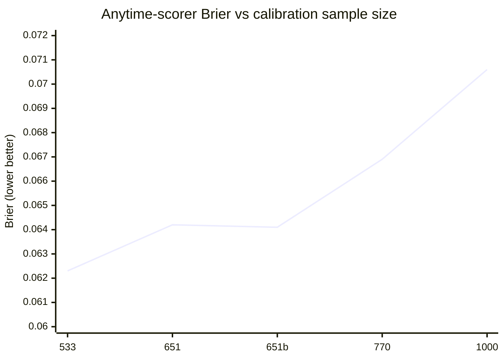
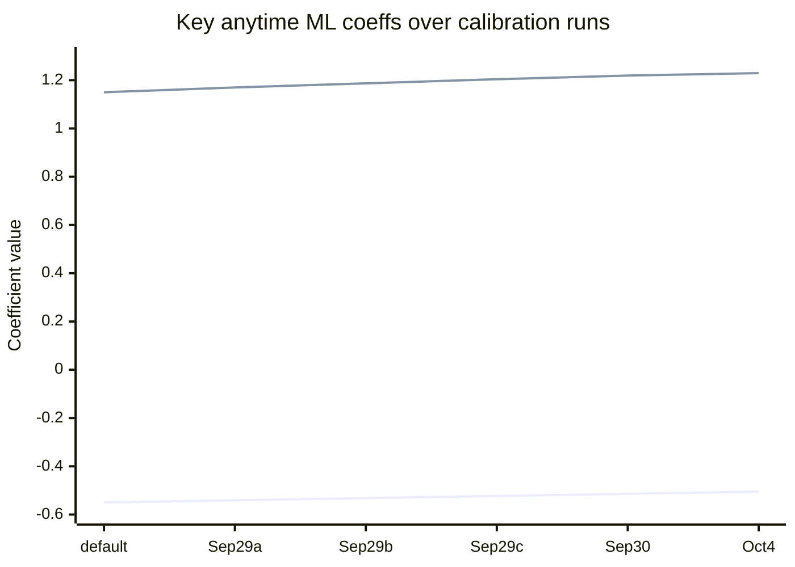
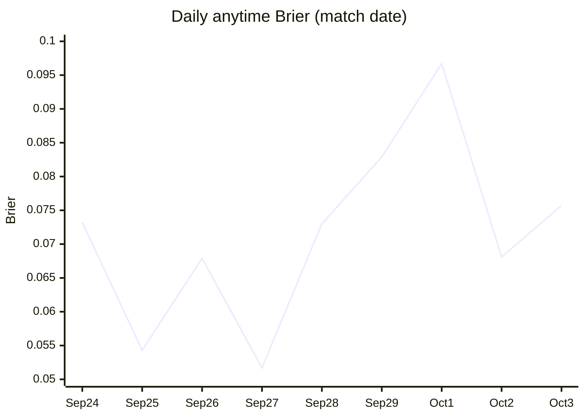
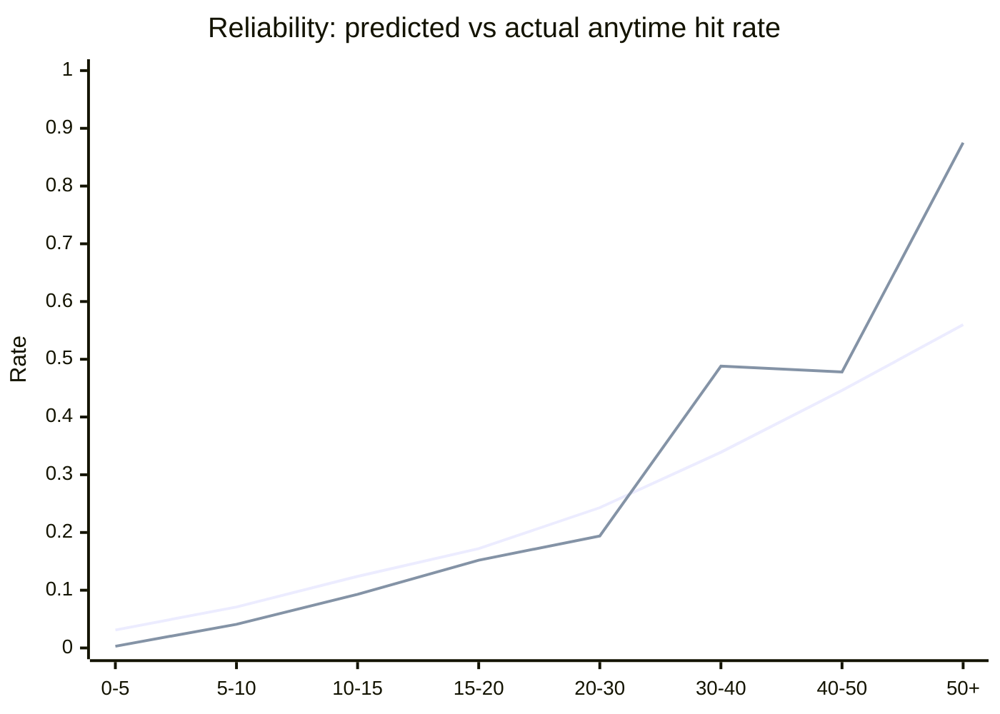
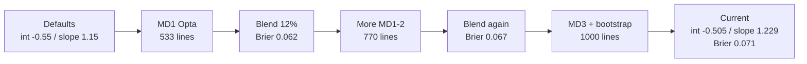

---
output:
  html_document: default
  pdf_document: default
---
# NL post-match evaluation - 4 Oct 2026

Analysis of `npm run nl:postmatch` (terminal run, exit 0) plus comparison against prior evaluate/calibrate runs stored in `nations_league_calibration_config` and `nations_league_player_prop_evaluations`.

**Bottom line:** anytime-scorer learning is healthy and converging slowly under the 12% blend. Brier rose from **0.0623 → 0.0706** as the sample grew from 533 → 1000 lines, mostly from harder / bootstrapped MD3 fixtures - not a broken model. Shots-on-target props remain badly miscalibrated and are the clear next fix.

---

## 1. What this run did

| Step | Result |
|------|--------|
| Player-stats ingest | **26** new matches ingested, **52** skipped (already present), **78** scores marked finished |
| Ratings | Recomputed for **54** nations from **2300** unique matches / **3502** form rows |
| Hub lock | **0** new upcoming locks, **78** already present; hub shows recent **24**, upcoming **102** |
| Prop evaluate | **1845** lines across **48** Opta matches (678 finished NL matches still lack Opta stats) |
| Prop calibrate | Retrained on **1000** anytime-scorer rows → Brier **0.0706** |

### New MD3 fixtures ingested (sample)

High-signal results from this window: Croatia 0-7 England, Poland 6-0 Romania, Denmark 2-4 Portugal, Belgium 3-0 Türkiye, Spain 3-1 Czechia, Belarus 4-0 San Marino.

### Locked vs bootstrap props

| Match window | Prop source in evaluate | Notes |
|--------------|-------------------------|-------|
| 24-29 Sep | `using locked snapshot.player_props` | True pre-match lock |
| 1-3 Oct | `attached player_props bootstrap` | Graham + props generated at evaluate time (form before kickoff), not a prior hub lock |

MD3 evaluation quality is therefore slightly apples-to-oranges vs MD1-2. Treat the Oct Brier bump carefully.

---

## 2. Calibration history (what is happening over time)

Defaults before any NL prop training: `intercept = -0.550`, `logLambdaSlope = 1.150`.

| When (UTC) | Samples | Brier | intercept | logLambdaSlope | chanceIndex | starter | teamXg |
|------------|---------|-------|-----------|----------------|-------------|---------|--------|
| 29 Sep 08:00 | 533 | 0.0623 | -0.541 | 1.170 | 0.283 | 0.189 | 0.091 |
| 29 Sep 09:45 | 651 | 0.0642 | -0.532 | 1.187 | 0.286 | 0.198 | 0.084 |
| 29 Sep 09:50 | 651 | 0.0641 | -0.523 | 1.204 | 0.289 | 0.207 | 0.076 |
| 30 Sep 09:55 | 770 | 0.0669 | -0.514 | 1.219 | 0.293 | 0.216 | 0.072 |
| **4 Oct 09:40** | **1000** | **0.0706** | **-0.505** | **1.229** | **0.296** | **0.225** | **0.067** |

Delta since first successful calibrate (29 Sep → 4 Oct):

| Metric | Change | Interpretation |
|--------|--------|----------------|
| Samples | +467 (+88%) | Much more evidence; less noise per update |
| Brier | +0.0083 | Slightly worse absolute score as harder / bootstrap games enter |
| intercept | -0.550 → -0.505 | Base rate pull less harsh (model less "everyone is low") |
| logLambdaSlope | 1.150 → 1.229 | More weight on predicted λ - ranking signal strengthening |
| starterSlope | 0.189 → 0.225 | Starters get a larger lift |
| teamXgSlope | 0.091 → 0.067 | Team xG contributes a bit less vs player λ / chance index |

Blend step is only **12%** toward newly trained coeffs each run, so the path is intentionally smooth.

### Brier vs sample size

### Coefficient drift

**Read:** intercept is creeping toward zero while λ-slope rises. The model is learning that relative goal λ separates scorers better than a flat down-weight, and that starters / chance-index matter more as Opta minutes accumulate.

---

## 3. Current evaluation stock (all rows in DB)

After this run the table holds **2576** prop rows across **67** distinct Opta matches.

| Market | Rows | Matches | Hit rate | Avg predicted P | Brier | Bias (pred − actual) |
|--------|------|---------|----------|-----------------|-------|----------------------|
| anytime_scorer | 1034 | 67 | 9.6% | 11.5% | **0.0700** | +1.9 pp (mild over) |
| sot_0.5 | 514 | 67 | 27.8% | 55.1% | 0.2351 | **+27.3 pp** |
| sot_1.5 | 514 | 67 | 9.9% | 42.1% | 0.1984 | **+32.2 pp** |
| sot_2.5 | 514 | 67 | 3.1% | 35.6% | 0.1631 | **+32.5 pp** |

Anytime is in a sensible calibration band. SoT lines are systematically overconfident by ~27-33 percentage points - those markets should not be trusted for pricing until recalibrated or rebuilt.

### Evaluate coverage growth (terminal / computed_at)

| Run | Prop lines written | Opta matches | Anytime samples used to train |
|-----|--------------------|--------------|-------------------------------|
| 28 Sep (first bootstrap attempt) | 89 | 34 | (no successful calibrate) |
| 29 Sep (first good evaluate+calibrate) | 1343 | 34 | 533 |
| 30 Sep (config row) | - | - | 770 |
| **4 Oct (this run)** | **1845** | **48** | **1000** |

---

## 4. Anytime scorer - deeper read

### By match date

| Date | Matches | Lines | Hit rate | Avg pred | Brier |
|------|---------|-------|----------|----------|-------|
| 24 Sep | 8 | 127 | 11.0% | 11.8% | 0.073 |
| 25 Sep | 8 | 133 | 7.5% | 11.8% | 0.054 |
| 26 Sep | 10 | 148 | 10.8% | 13.2% | 0.068 |
| 27 Sep | 8 | 125 | 6.4% | 10.2% | 0.052 |
| 28 Sep | 8 | 118 | 9.3% | 10.7% | 0.073 |
| 29 Sep | 8 | 119 | 11.8% | 12.4% | 0.083 |
| 1 Oct | 5 | 83 | 12.0% | 10.4% | 0.097 |
| 2 Oct | 7 | 108 | 8.3% | 11.2% | 0.068 |
| 3 Oct | 5 | 73 | 9.6% | 10.7% | 0.076 |

### MD1-2 vs MD3 windows

| Window | Lines | Matches | Hit rate | Avg pred | Brier | Bias |
|--------|-------|---------|----------|----------|-------|------|
| MD1-2 (to 29 Sep) | 770 | 50 | 9.5% | 11.7% | 0.0669 | +2.2 pp |
| MD3 (1-3 Oct) | 264 | 17 | 9.8% | 10.8% | 0.0792 | +0.9 pp |

MD3 bias is *better* (closer to zero) even though Brier is worse. That pattern usually means more variance / blowout results (England 7, Poland 6, 0-0s) rather than systematic overpricing.

### Reliability (predicted P vs actual hit rate)

| Pred bin | n | Avg pred | Actual hit rate | Bias |
|----------|---|----------|-----------------|------|
| 0-5% | 317 | 3.1% | 0.3% | +2.8 pp |
| 5-10% | 296 | 7.1% | 4.1% | +3.1 pp |
| 10-15% | 151 | 12.4% | 9.3% | +3.1 pp |
| 15-20% | 105 | 17.2% | 15.2% | +1.9 pp |
| 20-30% | 93 | 24.3% | 19.4% | +5.0 pp |
| 30-40% | 41 | 33.9% | **48.8%** | **-14.8 pp** |
| 40-50% | 23 | 44.6% | 47.8% | -3.2 pp |
| 50%+ | 8 | 56.0% | **87.5%** | **-31.5 pp** |

**Interpretation**

- Low/mid probs (most of the book, ~90% of lines) are slightly hot - predicted a few points above reality.
- High-prob stars (Kane, Mbappé, Gyökeres, Yamal, Lewandowski, etc.) are underpriced: when the model says ≥30%, they actually score ~53% of the time (avg pred ~40%).
- Net Brier stays decent because the mass of lines is in the low bins.

### Band summary

| Band | n | Avg pred | Actual | Verdict |
|------|---|----------|--------|---------|
| Low (&lt;15%) | 764 | 6.5% | 3.5% | Mild over |
| Mid (15-30%) | 198 | 20.5% | 17.2% | Mild over |
| High (30%+) | 72 | 39.8% | 52.8% | Underconfident |

---

## 5. Shots on target - problem markets

SoT is the weak spot of the current prop stack:

```mermaid
xychart-beta
  title "SoT overconfidence (avg pred vs hit rate)"
  x-axis ["sot_0.5", "sot_1.5", "sot_2.5"]
  y-axis "Probability" 0 --> 0.6
  bar "avg predicted" [0.551, 0.421, 0.356]
  bar "actual hit rate" [0.278, 0.099, 0.031]
```

Likely causes (from how props are built today):

1. SoT λ is too high relative to Opta SoT outcomes (or minutes / role share is too aggressive).
2. There is no SoT-specific logistic recalibration in `nl:calibrate-player-props` (only anytime-scorer ML coeffs are retrained).
3. Evaluate still scores SoT lines, so the error is visible but not yet learning.

Until a SoT calibrator exists, treat SoT hub odds as directional only.

---

## 6. Pipeline health (non-prop)

| Area | Status |
|------|--------|
| Ingest idempotency | Good - 52/78 already ingested skipped cleanly |
| Ratings | Full recompute succeeded for all 54 nations |
| Hub | Snapshot refreshed; upcoming locks already present (no double-lock) |
| Evaluate bootstrap | Working for finished matches that lacked locked `player_props` |
| Calibrate gate | ≥8 anytime rows - easily cleared (1000) |

No failures in this run. The learning loop is live.

---

## 7. What the model is doing over time (story)

1. **Early MD1** looked artificially sharp (Brier 0.062) on a smaller, locked-prop sample.
2. **Each calibrate** gently moves coeffs: higher λ sensitivity, higher starter/chance weights, softer intercept, softer team-xG slope.
3. **MD3** adds variance (blowouts + 0-0s) and bootstrap props → Brier drifts up, but mean bias improves.
4. **Anytime ranking** of big names is directionally good; absolute low-end probs are a touch high.
5. **SoT** is not participating in the learning loop and is the main product risk.

---

## 8. Recommended next checks

1. **Lock MD3 props before kickoff** for the next window so evaluate stops mixing bootstrap and locked rows.
2. **Add SoT calibration** (or a strong prior shrink) - same pattern as anytime logistic blend.
3. **Watch high-prob underconfidence** - if it persists after more MD3 locks, consider a small lift on top-decile λ / chance-index rather than more intercept movement.
4. **Optional Graham 1X2 backtest** on finished scores is still outside `nl:postmatch`; this report covers player props only.

---

## Sources

- Terminal: `nl:postmatch` 4 Oct 2026 (exit 0)
- Prior terminal: `nl:evaluate-player-props` + `nl:calibrate-player-props` 29 Sep 2026 (1343 lines / Brier 0.0623)
- Supabase: `nations_league_calibration_config` (5 versions), `nations_league_player_prop_evaluations` (2576 rows)
